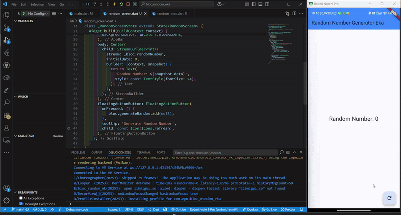

## Praktikum 7 : BLoC Pattern

### Soal 13



Pada Praktikum 7 ini, merupakan contoh penerapan pola arsitektur BLoC (Business Logic Component) secara sederhana, di mana angka acak dihasilkan setiap kali tombol ditekan.

Antarmuka pengguna (UI) tidak menangani proses pembuatan angka, melainkan hanya menampilkan data yang dikirim oleh state melalui stream. Dengan demikian, logika aplikasi dipisahkan dari tampilan — sesuai dengan prinsip dasar BLoC.

Terdapat 3 bagian pada letak konsep pola BLoC, berikut codenya :

```dart
Event (aksi dari pengguna)
→ Pemicu aksi: generateRandom.add(null) saat tombol ditekan.

Business Logic (proses di balik layar)
→ Menjalankan logika: Random().nextInt(10) untuk menghasilkan angka acak.

State (hasil yang ditampilkan ke pengguna)
→ UI menampilkan hasil: StreamBuilder<int> merender snapshot.data ke layar.
```
